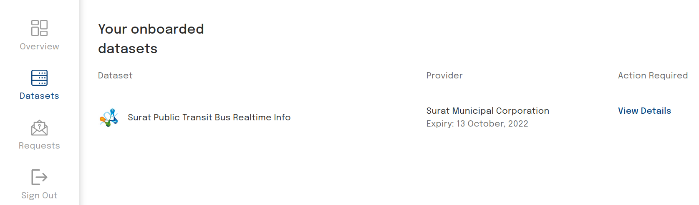

# Getting Started: Consumer

## Introduction
The IUDX Auth Consumer APIs allow consumers to view the resources they have been granted access to using the [Consumer Panel](https://consumer.iudx.org.in)

## Registration
A new consumer can register with an account when prompted to login at the [Consumer Panel](https://consumer.iudx.org.in). Go to [Registration](./registration.md) for instructions on registering.

## View Resources
A Consumer may view the resources they have been given access to by various providers in the Datasets tab.

<br>
*View resources that consumer has access to*

## Tokens
A user may be able to generate tokens using their client ID and client secret. See [Registration](./registration.md) for more details on the client ID and client secret.

Note that tokens have an expiry time of **12 hours** and are issued per resource group or resource item. As we now use JWT tokens, users may be able to decode tokens using [jwt.io](https://jwt.io) or by using the token introspection API (which will validate signature, expiry, revocation status of the token and policy status of the particular resource. If all these are successfully validated, the decoded token is returned.)

### Getting tokens for accessing open/public resources - except subscription access
Tokens are now required to access open/public resources on the IUDX Resource Server. To request for a token for any open resource via cURL

```
curl --location --request POST 'https://authorization.iudx.org.in/auth/v1/token' \
--header 'clientId:<IUDX-clientID>' \
--header 'clientSecret: <IUDX-clientSecret>' \
--header 'Content-Type: application/json' \
--data-raw '{
  "itemId": "rs.iudx.org.in",
  "itemType": "resource_server",
  "role": "consumer"
}'
```

The response would contain a field `accessToken`. This value should be used in the `token` header in the API call to the resource server.

### Getting tokens for accessing private resources
If a consumer has a policy set for some resource group, they may request for tokens to access the resource group or resource items in said resource group

```
curl --location --request POST 'https://authorization.iudx.org.in/auth/v1/token' \
--header 'clientId:<IUDX-clientID>' \
--header 'clientSecret: <IUDX-clientSecret>' \
--header 'Content-Type: application/json' \
--data-raw '{
  "itemId": "suratmunicipal.org/6db486cb4f720e8585ba1f45a931c63c25dbbbda/rs.iudx.org.in/surat-itms-realtime-info",
  "itemType": "resource_group",
  "role": "consumer"
}'

```
*Getting token for resource group*

```
curl --location --request POST 'https://authorization.iudx.org.in/auth/v1/token' \
--header 'clientId:<IUDX-clientID>' \
--header 'clientSecret: <IUDX-clientSecret>' \
--header 'Content-Type: application/json' \
--data-raw '{
  "itemId": "suratmunicipal.org/6db486cb4f720e8585ba1f45a931c63c25dbbbda/rs.iudx.org.in/surat-itms-realtime-info/surat-itms-live-eta",
  "itemType": "resource",
  "role": "consumer"
}'

```
*Getting token for resource*

The response would contain a field `accessToken`. This value should be used in the `token` header in the API call to the resource server.
