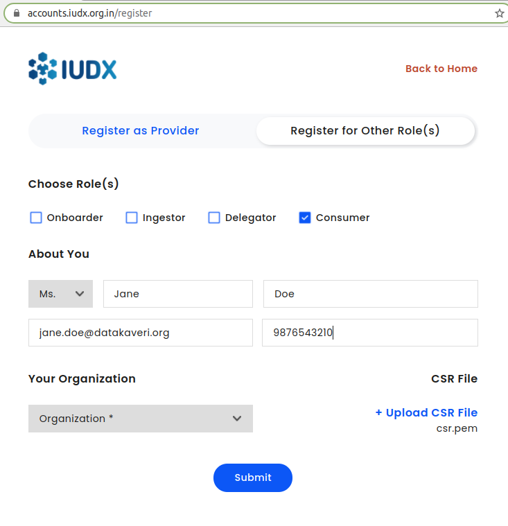

# Getting Started: Consumer

## Introduction
The IUDX Auth Consumer API is used to obtain consumer certificates and authorization tokens. The certificate is used to uniquely identify a consumer and is issued by the IUDX Certificate Authority. It can be obtained from the Registration API. The authorization tokens are obtained using the certificate, by specifying the resources which the consumer wants to access, along with the capabilities. Both these API flows are specified below.

## Registration
A new consumer must register ([Consumer Registration Panel](https://register.iudx.org.in/other-roles)) with the IUDX platform with some basic identification details. These details include their name, email address and phone number. Additionally, they should also generate a Certificate Signing Request (CSR) and include that in the API call. This CSR is used to generate a signed certificate which will be delivered to the email address they have specified.

<br>
*Consumer registration*

## CSR Generation

CSR generation requires OpenSSL. To install OpenSSL on Windows, please follow steps 1 and 2 from here: [OpenSSL Windows Installation Instructions](https://www.namecheap.com/support/knowledgebase/article.aspx/10161/14/generating-a-csr-on-windows-using-openssl). OpenSSL is most likely preinstalled on Linux and MacOS. If you find it missing please visit [OpenSSL Homepage](https://www.openssl.org/) for more information on how to install it.

To generate a CSR, please use the OpenSSL command in the command line:
```bash
openssl req -new -newkey rsa:2048 -nodes -out csr.pem -keyout privkey.pem -subj "/"
```
This will generate 2 files: `privkey.pem` and `csr.pem`. Please send the contents of csr.pem file in the registration API.

**Warning**: Please ensure the `privkey.pem` is stored securely. Do not share it. If this file is lost, then a new CSR + certificate will need to be created.

## Obtaining Token
A token can be obtained using the certificate which the consumer during the registration flow. These tokens have to be scoped to specific IUDX Resource Groups and actions associated with them. This can be done by specifying the Resource Group ID and the Resource Server API endpoints that the consumer wants to access, in the [Token Request API](https://authdocs.iudx.org.in/#operation/post-auth-v1-token). Whether the token is granted or not is dependent on whether the resource group/API endpoint is secure, and what policies have been set by the provider for the consumer. The Resource Server API endpoints which are available are:

* Latest Data
`/ngsi-ld/v1/entities/<resource_group_id>`
* Temporal Data
`/ngsi-ld/v1/temporal/entities`
* Complex GET
`/ngsi-ld/v1/entities`
* Complex POST
`/ngsi-ld/v1/entityOperations/query`
* Subscription Data
`/ngsi-ld/v1/subscription`

Once the token is obtained, it can be used to call the Resource Server APIs.

### curl command for Token API

The following curl command can be used to request a token. Ensure that the command in the directory containing your certificate and private-key .PEM files. The `request` array can contain multiple objects that specify resource IDs and corresponding APIs for which access is desired. (For a token for access to the entire resource group, the resource group ID must be suffixed by `/*`)

```
curl -XPOST https://authorization.iudx.org.in/auth/v1/token --cert <certificate-filename> --key <private-key-filename> -H 'content-type: application/json' -d "{
   "request":[
      {
         "id":"<resource-id>",
         "apis":[
            <list-of-APIs-to-be-called-on-resource>
         ]
      }
   ]
}

```

```
# Example Request
curl -XPOST https://authorization.iudx.org.in/auth/v1/token --cert cert.pem --key private-key.pem -H 'content-type: application/json' -d "{
   "request":[
      {
         "id":"datakaveri.org/04a15c9960ffda227e9546f3f46e629e1fe4132b/rs.iudx.org.in/pune-aqm/*",
         "apis":[
            "/ngsi-ld/v1/subscription"
         ]
      },
      {
         "id":"datakaveri.org/04a15c9960ffda227e9546f3f46e629e1fe4132b/rs.iudx.org.in/pune-flood/item-28819",
         "apis":[
            "/ngsi-ld/v1/entities",
            "/ngsi-ld/v1/entities/datakaveri.org/04a15c9960ffda227e9546f3f46e629e1fe4132b/rs.iudx.org.in/pune-flood"
         ]
      }
   ]
}"

# Example Response
{
    "token": "authorization.iudx.org.in/consumer@datakaveri.org/5d26f8526d75f5ed9407d7a808edac38",
    "token-type": "IUDX",
    "expires-in": 604800,
    "is_token_valid": true,
    "server-token": {
        "rs.iudx.org.in": true
    }
}

```

