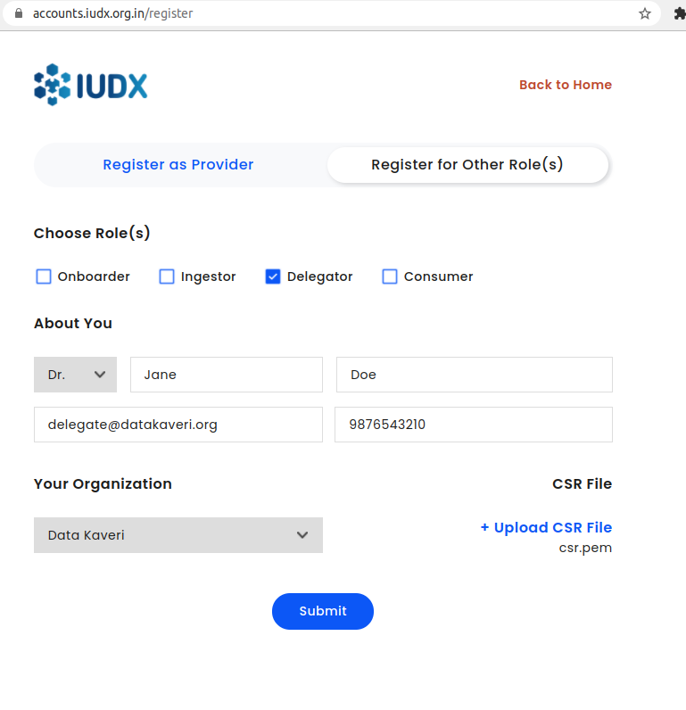
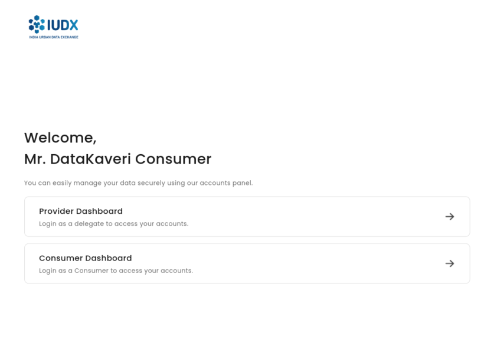
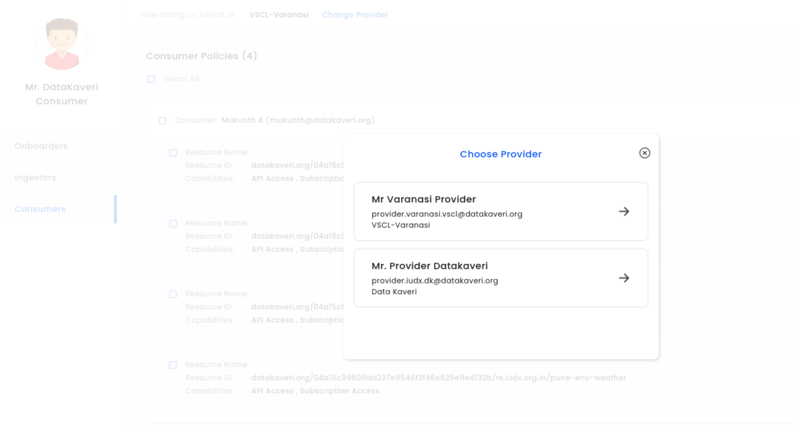

# Getting Started: Delegate

## Introduction
The IUDX Auth Delegate API is used to obtain certificate. The certificate is used to uniquely identify a delegate and is issued by the IUDX Certificate Authority. It can be obtained from the Registration API. A Delegate may manage access policies on behalf of multiple Providers. Once a Provider has set a Delegate policy, the Delegate may access the Provider Dashboard using the [Accounts Panel](https://accounts.iudx.org.in)

## Registration
A new delegate must register ([Delegate Registration Panel](https://accounts.iudx.org.in/register)) with the IUDX platform with some basic identification details. These details include their name, email address and phone number. Additionally, they should also generate a Certificate Signing Request (CSR) that is to be uploaded during registration. This CSR is used to generate a signed certificate which will be delivered to the email address they have specified.

<br>
*Delegate registration*

## CSR Generation

CSR generation requires OpenSSL. To install OpenSSL on Windows, please follow steps 1 and 2 from here: [OpenSSL Windows Installation Instructions](https://www.namecheap.com/support/knowledgebase/article.aspx/10161/14/generating-a-csr-on-windows-using-openssl). OpenSSL is most likely preinstalled on Linux and MacOS. If you find it missing please visit [OpenSSL Homepage](https://www.openssl.org/) for more information on how to install it.

To generate a CSR, please use the OpenSSL command in the command line:
```bash
openssl req -new -newkey rsa:2048 -nodes -out csr.pem -keyout privkey.pem -subj "/"
```
This will generate 2 files: `privkey.pem` and `csr.pem`. Please send the contents of csr.pem file in the registration API.

**Warning**: Please ensure the `privkey.pem` is stored securely. Do not share it. If this file is lost, then a new CSR + certificate will need to be created.

## Adding certificate to the browser

In order to use the Provider Dashboard, the certificate needs to be added to the browser. The Chrome browser is preferred.

1. Convert the certificate and private key to the PKCS12 format, which is required to load it into the browser. To do this, make sure the private key and certificate files are in the same directory. Then run the following OpenSSL command, replacing <certificate file> with the name of the certificate file sent to you (e.g. cert.pem). When prompted for a password, you may add one, or just press Enter to leave the password blank.

```
openssl pkcs12 -inkey privkey.pem -in <certificate file> -export -out certificate.p12
```

2. Add the certificate.p12 file to the browser 
    1. For Chrome in Linux -
        1. Go to **Settings > Privacy and Security** and click **More**
        2. Click the **Manage Certificates** option (Alternatively use the URL `chrome://settings/certificates` in the address bar)
        3. Under the **Your Certificates** option, click **Import** and  to the `certificate.p12` file. Enter the password if you have set one

		<br>
		*Click Manage Certificates in the Privacy and Security tab in Chrome settings*

		<br>
		*Import the certificate under the 'Your Certificates' option*

    2. For Chrome in Windows -
        1. Go to **Settings > Privacy and Security** and click **Security**
        2. Click the **Manage Certificates** option
        3. Under the **Personal** option, click Import and then click next when shown the **Certificate Import Wizard**, Click on browse and navigate to the `certificate.p12` file. Enter the password if you have set one
        
        <br>
		*Click Manage Certificates in the Privacy and Security tab in Chrome settings*

		<br>
		*Use the Windows Certificate Import Wizard to import your certificate*
		
		<br>
		*Click Import under the 'Personal' option*

    3. For Chrome in Mac OS, you can follow the instructions in [this](https://www.digicert.com/kb/managing-client-certificates.htm#chrome_import_cert_2) link

After this, when going to the [Accounts Panel](https://accounts.iudx.org.in), the certificate dialog will appear. Once the correct certificate is chosen, you will be prompted to enter the Provider Dashboard.

<br>
*Dialog to choose certificate in Chrome*

<br>
*Prompt to enter Provider Dashboard as Delegate*

**If a certificate is not chosen, then the API may not be called correctly. You will have to restart your browser, or open an Incognito/Private session and try again.**

## Manage Policies

In the dashboard, a Delegate may view and switch between the Providers who have granted them access. Once a Provider is chosen, the Delegate can read, write and update policies for that Provider.

<br>
*View and change Providers*

To manage policies for consumers, onboarders and data ingesters, please see the associated sections in [Getting Started: Provider](./producer.md). **Note that delegates may not create/update/delete delegate policies.**
