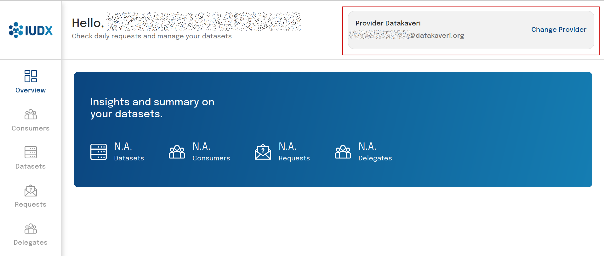

# Getting Started: Auth-Delegate

## Introduction
The IUDX Auth Auth-Delegate APIs allow assigned delegates to manage policies and delegations on behalf of the providers who have assigned them. Auth-Delegates may perform these operations using the [Publisher Panel](https://publisher.iudx.org.in).

## Registration
A new delegate can register with an account when prompted to login at the [Publisher Panel](https://publisher.iudx.org.in). Go to [Registration](./registration.md) for instructions on registering.

Once a delegate registers, **they will only be able to log into the Publisher Panel when the Provider has set a delegation (and when the Auth server administrator has set a policy for them)**.

## Managing Policies and Delegations for different Providers

In the Publisher Panel, an Auth-Delegate may view and switch between the Providers who have granted them access. Once a Provider is chosen, the Delegate can view, create and delete both policies and delegations for said Provider.

 
*View and change Providers*

**NOTE: Auth-Delegates are not permitted to create other Auth-Delegates**

To manage policies and delegations, please see the associated sections in [Getting Started: Provider](./producer.md).
