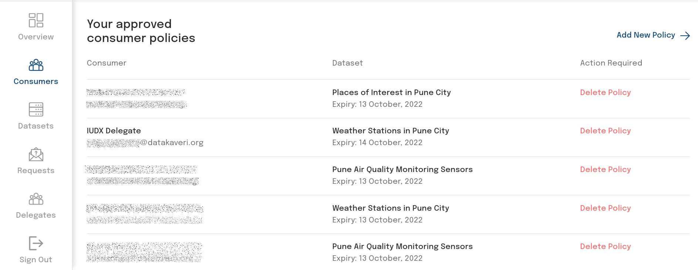
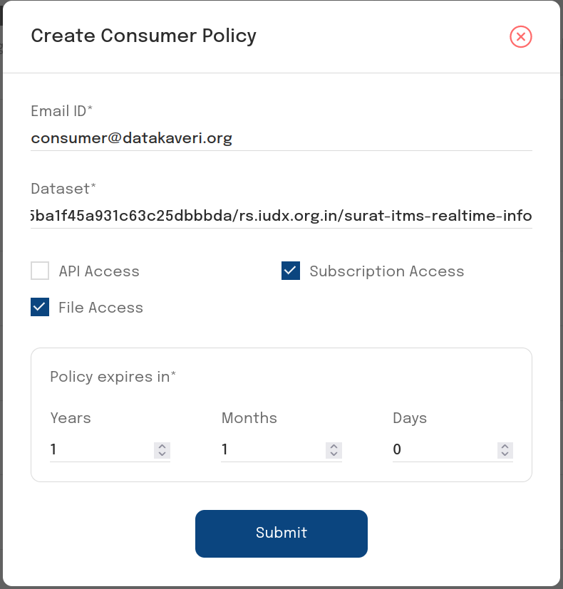
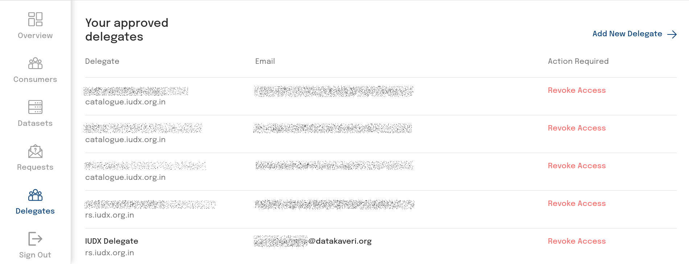
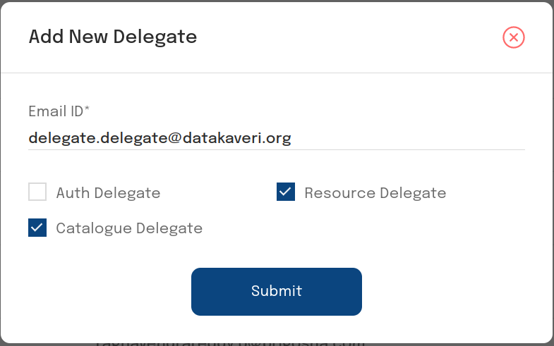

# Getting Started: Provider

## Introduction

The IUDX Auth Provider APIs allow a provider to manage access to the secure resources they own via the [Publisher Panel](https://publisher.iudx.org.in)

## Registration and Provider Approval

The IUDX Admin team will initiate a provider registration by first creating an entry for the provider's organization. A new provider can register with an account when prompted to login at the [Publisher Panel](https://publisher.iudx.org.in). Go to [Registration](./registration.md) for instructions on registering.

**NOTE: Provider registration is subject to approval. A user registered with the provider role may be able to access the Publisher Panel once they have been approved**. 

## Manage Policies
A provider can create, view and delete access policies set for consumers and delegates in the Consumers tab.

 
*View policies set for consumers*
 
A policy can be set for a consumer for a particular resource group/dataset with a restriction to access type. 

- **API Access** allows the consumer to call the Resource Server APIs (latest, temporal, attribute, complex etc.) on the resource group. 
- **Subscription Access** allows the consumer to subscribe to the resource via RabbitMQ.
- **File Access** allows the consumer to download the data in file form in case it is a file resource.

**The policy can only be created if the consumer exists and if the resource group/dataset exists on the IUDX Catalogue**. An expiry time for the policy can also be set. Once a policy expires, a consumer may not be able to request for tokens for the particular resource.

 
*Create policy*

## Delegations

Providers can delegate administrative tasks to pre-approved users having the delegate role. Delegates are assigned to a specific IUDX server which determines their capabilities.

### Catalogue (catalogue.iudx.org.in) Delegations
A provider can delegate the responsibility of creating IUDX Catalogue entries for their resources to a Catalogue delegate, who has pre registered with IUDX. Once a Catalogue delegate has been granted access, they can obtain an access token with which they can create and modify Catalogue entries for resources under the Provider account.

### Auth (authorization.iudx.org.in) Delegations
A provider can delegate the responsibility of creating and deleting policies, as well as creating and deleting delegations to an Auth delegate, who has pre registered with IUDX. Once an Auth delegate has been granted access, they may log onto the Provider Panel and manage policies and delegations on behalf of the Provider.

### Resource Server (rs.iudx.org.in) Delegation
A provider can also delegate the responsibility of uploading resources to the IUDX Resource Server to a Resource Server delegate, who has preregistered with IUDX. Once a Resource Server delegate has been granted access, they can obtain an access token with which they can configure an adapter to push data to the IUDX Resource Server.

### Manage Delegates
A provider may view, create and delete delegations in the Delegates tab.

 
*Viewing delegates*

 
*Add delegates*
