# Getting Started: Provider

## Introduction

The IUDX Auth Provider API is used to obtain provider certificates and authorization tokens. The certificate is used to uniquely identify a provider and is issued by the IUDX Certificate Authority through the Registration API. Using the certificate, a provider can manage access to the secure resources they own via the [Accounts Panel](https://accounts.iudx.org.in)

## Registration

The IUDX Admin team will initiate a provider registration by first creating an entry for the provider's organization. A new provider must then register ([Registration Panel](https://accounts.iudx.org.in/register)) with the IUDX platform with some basic identification details. These details include their name, organization email address and phone number. Additionally, they should also generate a Certificate Signing Request (CSR) that is to be uploaded during registration. This CSR is used to generate a signed certificate which will be delivered to the email address they have specified, after their registration request has been approved by the IUDX Admin team.

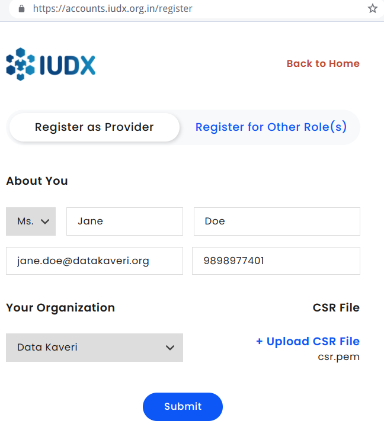<br>
*Provider registration*

## CSR Generation
CSR generation requires OpenSSL. To install OpenSSL on Windows, please follow steps 1 and 2 from here: [OpenSSL Windows Installation Instructions](https://www.namecheap.com/support/knowledgebase/article.aspx/10161/14/generating-a-csr-on-windows-using-openssl). OpenSSL is most likely preinstalled on Linux and MacOS. If you find it missing please visit [OpenSSL Homepage](https://www.openssl.org/) for more information on how to install it.

To generate a CSR, please use the OpenSSL command in the command line:
```bash
openssl req -new -newkey rsa:2048 -nodes -out csr.pem -keyout privkey.pem -subj "/"
```
This will generate 2 files: `privkey.pem` and `csr.pem` a private key file and a CSR file. Please send the contents of csr.pem file in the registration API.

**Warning**: Please ensure the privkey.pem is stored securely. Do not share it. If this file is lost, then a new CSR + certificate will need to be created.

## Adding certificate to the browser

In order to use the Provider Panel, the certificate needs to be added to the browser. The Chrome browser is preferred.

1. Convert the certificate and private key to the PKCS12 format, which is required to load it into the browser. To do this, make sure the private key and certificate files are in the same directory. Then run the following OpenSSL command, replacing <certificate file> with the name of the certificate file sent to you (e.g. cert.pem). When prompted for a password, you may add one, or just press Enter to leave the password blank.

```
openssl pkcs12 -inkey privkey.pem -in <certificate file> -export -out certificate.p12
```

2. Add the certificate.p12 file to the browser 
    1. For Chrome in Linux -
        1. Go to **Settings > Privacy and Security** and click **More**
        2. Click the **Manage Certificates** option (Alternatively use the URL `chrome://settings/certificates` in the address bar)
        3. Under the **Your Certificates** option, click **Import** and  to the `certificate.p12` file. Enter the password if you have set one

		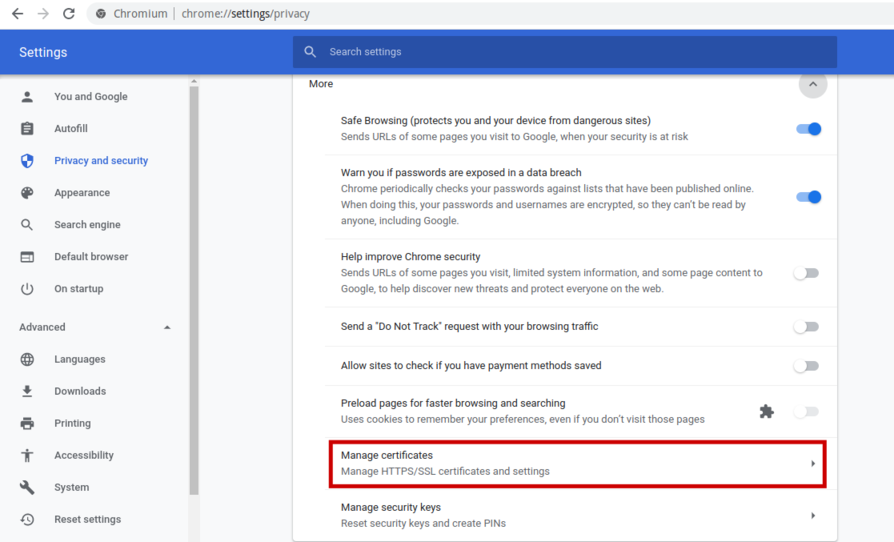<br>
		*Click Manage Certificates in the Privacy and Security tab in Chrome settings*

		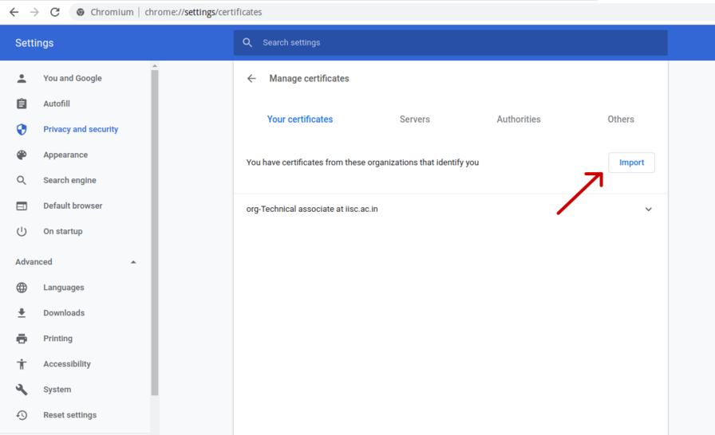<br>
		*Import the certificate under the 'Your Certificates' option*

    2. For Chrome in Windows -
        1. Go to **Settings > Privacy and Security** and click **Security**
        2. Click the **Manage Certificates** option
        3. Under the **Personal** option, click Import and then click next when shown the **Certificate Import Wizard**, Click on browse and navigate to the `certificate.p12` file. Enter the password if you have set one
        
        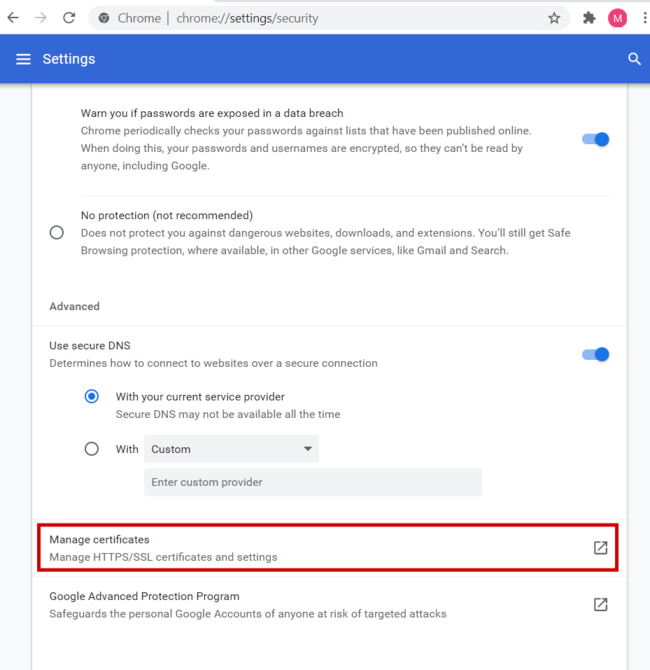<br>
		*Click Manage Certificates in the Privacy and Security tab in Chrome settings*

		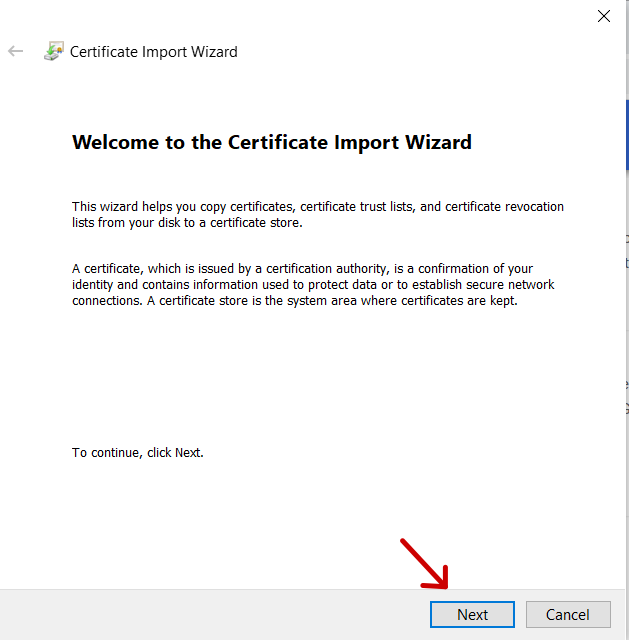<br>
		*Use the Windows Certificate Import Wizard to import your certificate*
		
		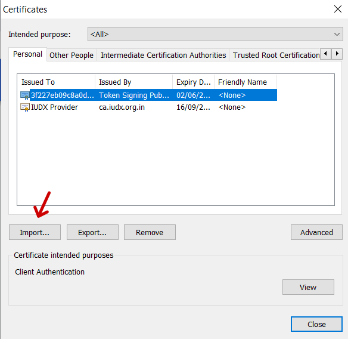<br>
		*Click Import under the 'Personal' option*

    3. For Chrome in Mac OS, you can follow the instructions in [this](https://www.digicert.com/kb/managing-client-certificates.htm#chrome_import_cert_2) link

After this, when going to the [Accounts Panel](https://accounts.iudx.org.in), the certificate dialog will appear. Once the correct certificate is chosen, you will be prompted to enter the Provider Dashboard.

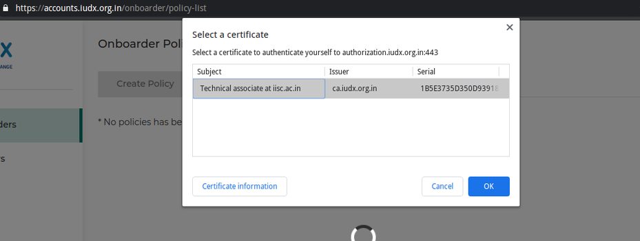<br>
*Dialog to choose certificate in Chrome*

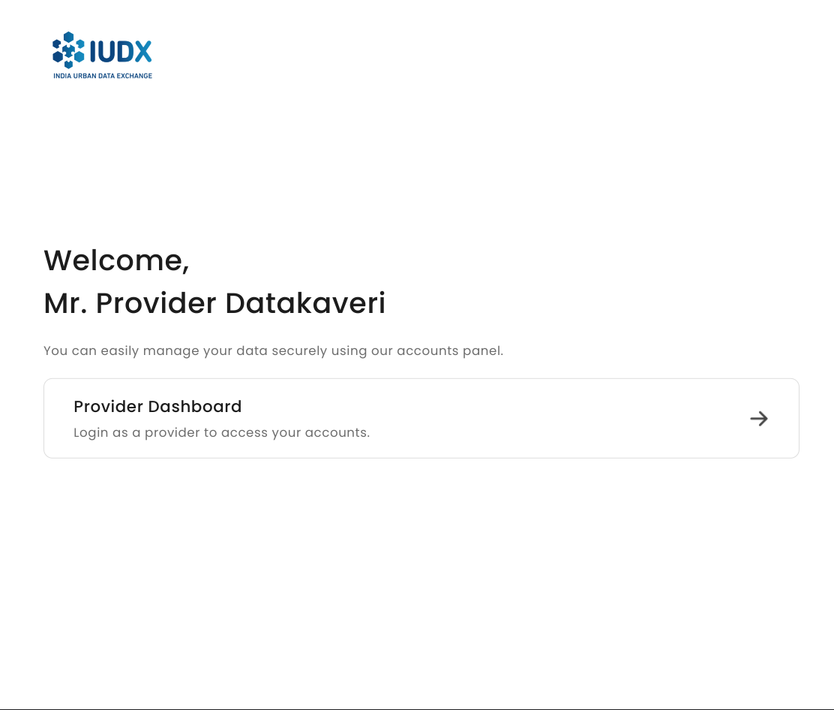<br>
*Prompt to enter Provider Dashboard*

**If a certificate is not chosen, then the API may not be called correctly. You will have to restart your browser, or open an Incognito/Private session and try again.**

## Manage Policies
A provider can create, view and delete access policies set for data ingesters, onboarders, delegates and consumers.

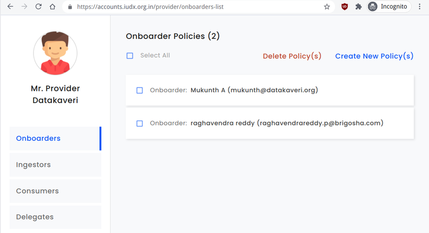<br>
*View policies set for onboarders*


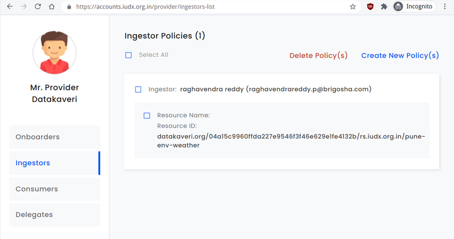<br>
*View policies set for data ingesters*


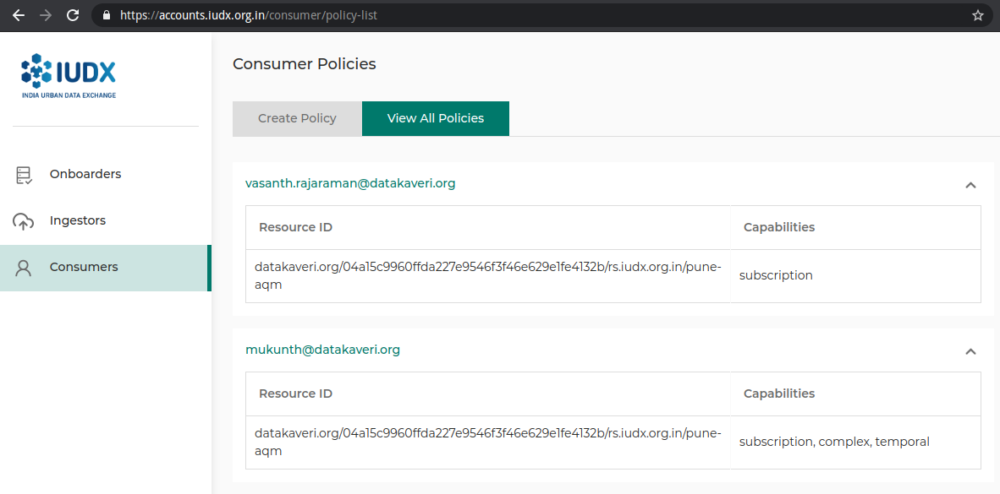<br>
*View policies set for consumers*


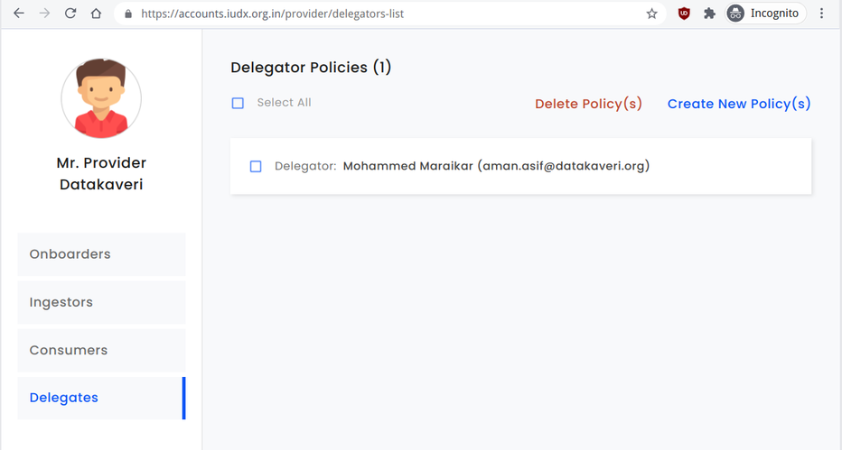<br>
*View policies set for delegates*
 
## Onboarder Access
A provider can delegate the responsibility of creating IUDX Catalogue entries for their resources to an Onboarder, who has pre registered with IUDX. Once an Onboarder has been granted access, they can obtain an access token with which they can create and modify Catalogue entries for resources under the Provider account.

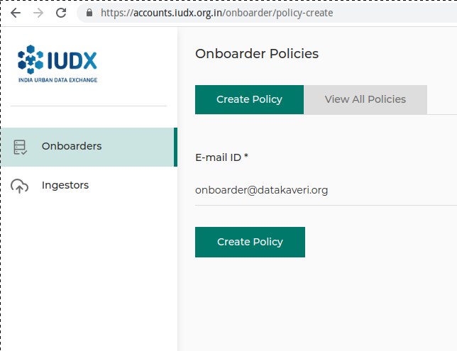<br>
*Add an onboarder policy*

## Delegate Access
A provider can delegate the responsibility of creating, updating and deleting policies to a Delegate, who has pre registered with IUDX. Once a Delegate has been granted access, they may log onto the Provider Panel and manage policies on behalf of the Provider.

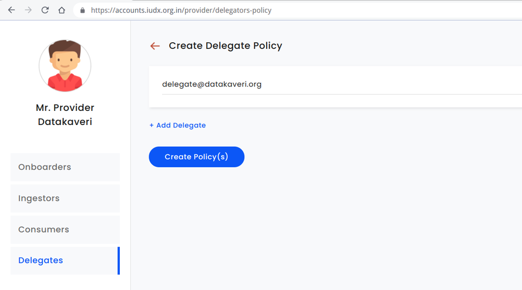<br>
*Add a delegate policy*

## Data Ingester Access
A provider can also delegate the responsibility of uploading resources to the IUDX Resource Server to an Data Ingester, who has preregistered with IUDX. Once a Data Ingester has been granted access, they can obtain an access token with which they can configure the Adapter to interface with the IUDX Resource Server.

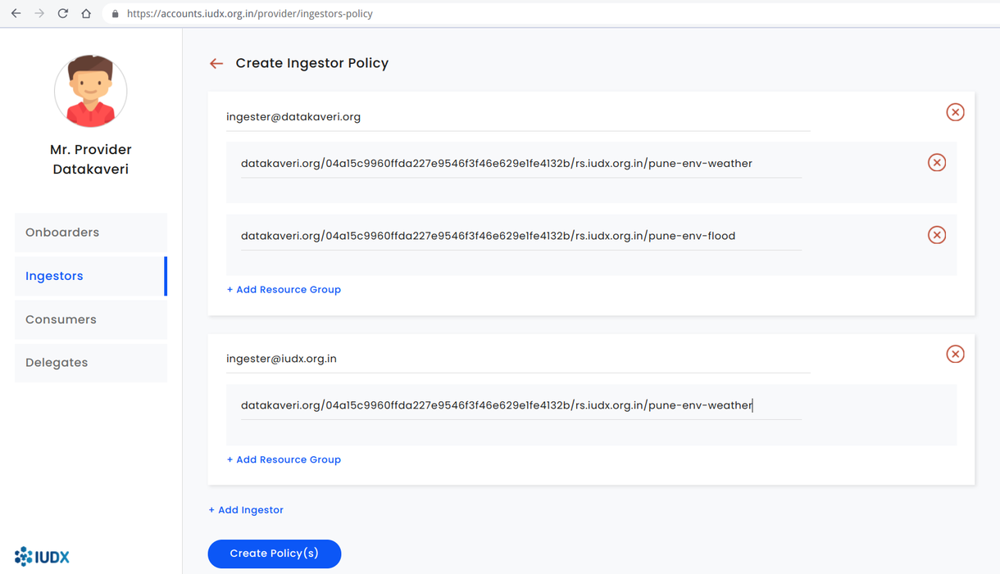<br>
*Add an data ingester policy*

## Consumer Access
A provider can grant access to consumers for the resources they own. This is done by specifying the consumer email address and whether API access (temporal search, attribute search, complex queries, latest data etc.) or Subscription access is to be granted for a particular resource.

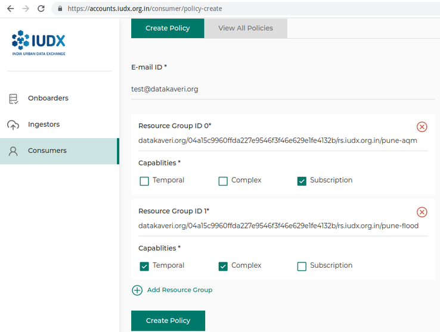<br>
*Add a consumer policy*

