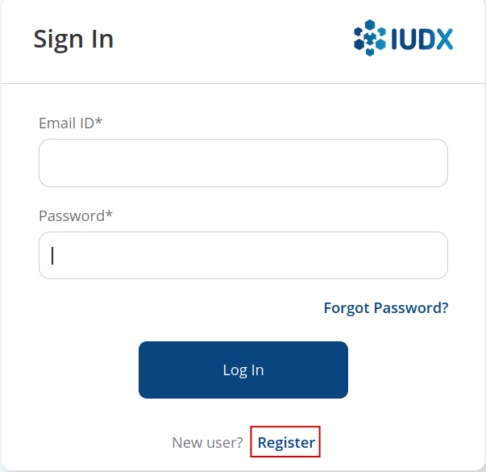
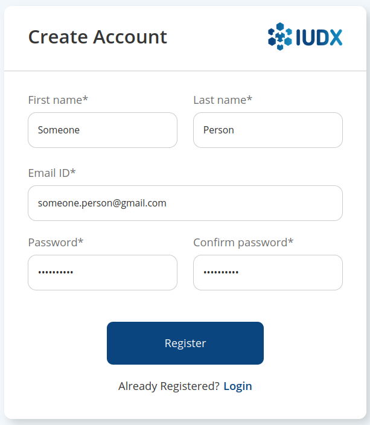
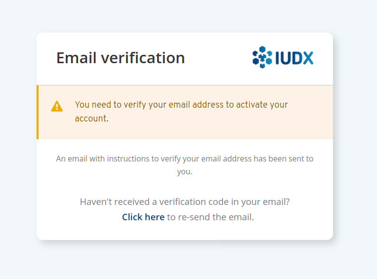
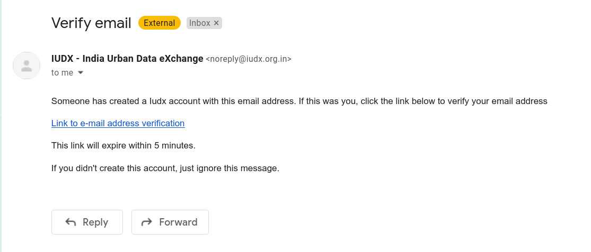
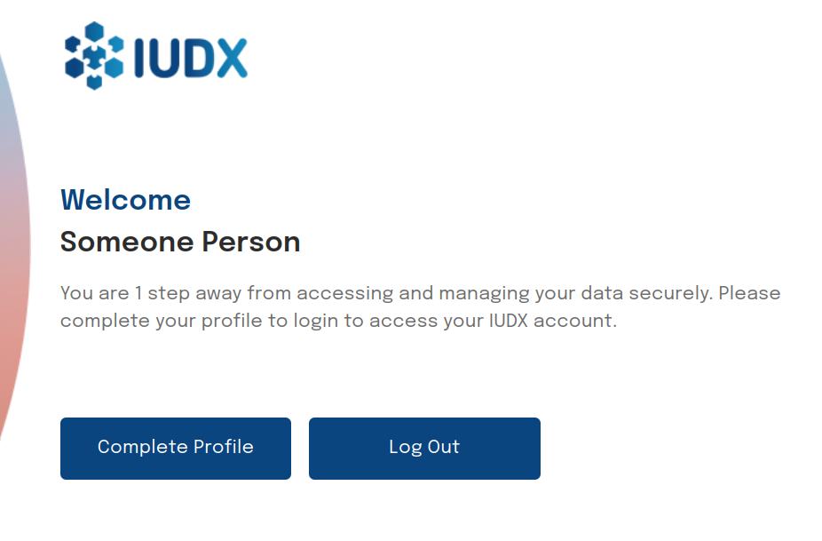
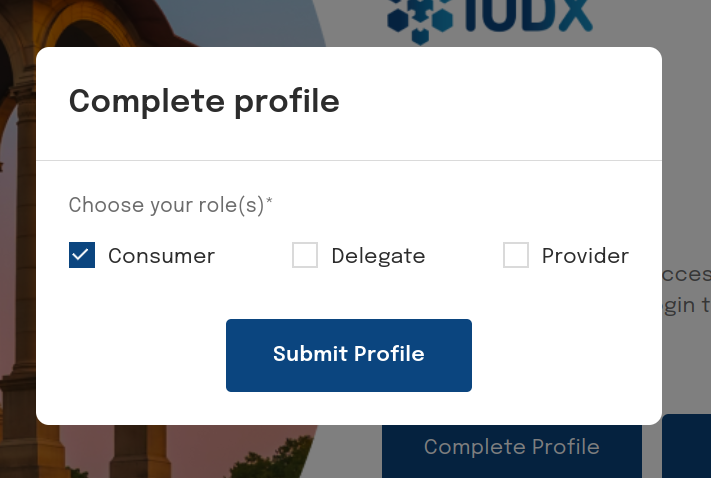
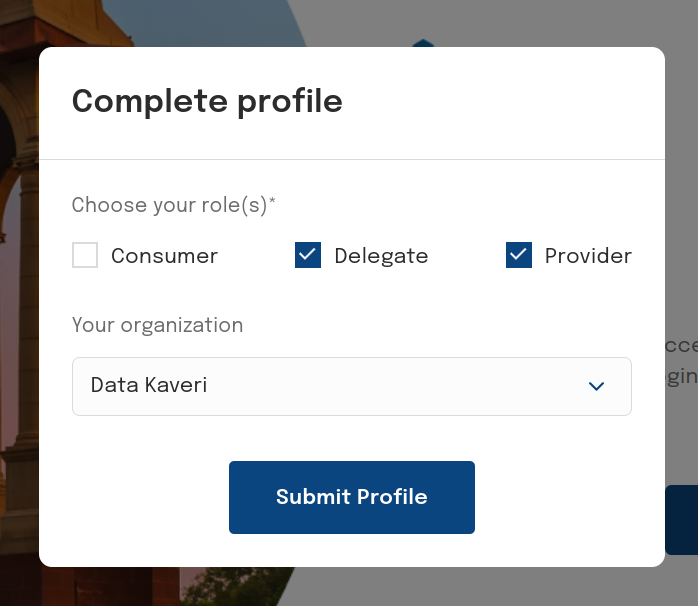
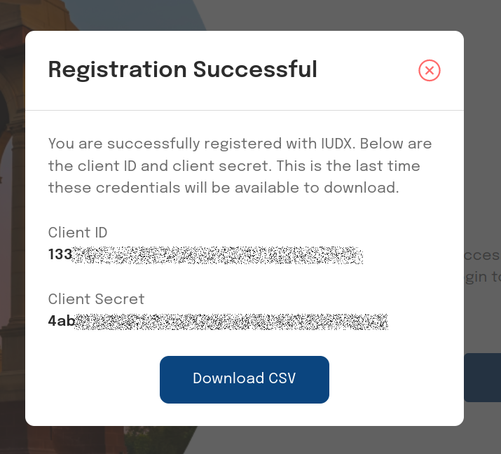

# Registration

## Introduction
Registration to use the IUDX platform is a two step process. Users are first required to create an account associated with an email address, and verify the account once created. This is followed by choosing the roles they would like to have.

### Provider and Delegate Registration

Providers and delegates are required to be associated with an organization. In the second step of registration, when choosing those roles, it is necessary to also choose an organization when selecting either `provider` or `delegate` roles. 

**The registered email domain needs to match the chosen organization's domain.** For e.g., *delegate@datakaveri.org* may be able to register as a delegate associated with Data Kaveri organization (as the domain is datakaveri.org), but not with IISc (as the domain is iisc.ac.in). 

In case you plan to register for these roles, please choose the appropriate email address. Registering for the consumer role has no such restrictions.

## Account Registration
* On entering the Consumer or Publisher Panels, there is an option to register when you are prompted to sign in.

 
*Register*

* Enter the required details.

 
*Account details*

* And verify your email address. You should receive an email at your registered address, with a verification link. On clicking the link, the first step of registration is completed.

 
*Email verification required*

 
*Sample email dialog*

 
*Account created, last step of registration pending*

## Choosing roles

Once email verification is complete, you can now choose the roles you would like to have, along with the appropriate organization (if applicable).

 
*Choosing consumer role*

 
*Choosing provider/delegate role*

## Successful registration and client ID, client Secret

**NOTE: Provider registration is subject to approval. A user registered with the provider role may be able to access the Publisher Panel once they have been approved**. 

If the registration is successful, a client ID and client secret would be presented. These credentials can be used to request for tokens via scripts or on the command line. **The client secret can only be viewed here, so keep it safe.** An API to update the client secret is being developed.

 
*Successful registration; client ID and client secret*
