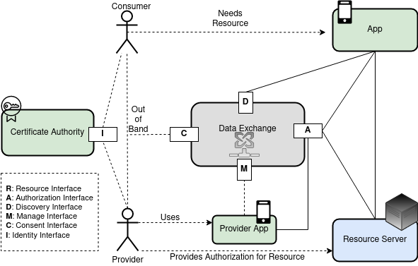
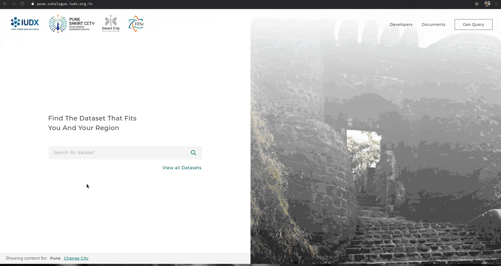

# Getting started with IUDX

IUDX - India Urban Data Exchange is a data exchange and discovery platform supported by the Ministry of Housing and Urban Affairs.

A brief architecture of IUDX is as shown below.

The primary components of IUDX are - 
1. IUDX Catalogue - Data dsicovery and resource meta-data store
2. IUDX Resource Server - Data exchange and distribution platform
3. IUDX Authorization Server - Data access control and resource sharing accounts server

## Getting started
The live instance of IUDX can be found [here](https://catalogue.iudx.org.in)
Using IUDX involves 
1. **Discovery** - Discover datasets through the UI or through IUDX Catalogue APIs
2. **Consent** - Obtaining permission and a token from *Providers* in case of *Private* resources 
3. **Access** - Using IUDX Resource Server APIs to access the data

### Discovery

#### Discovery through UI

 

- Type a domain you are interested in, say *flood*, in the search box
- The dataset list view shows the following
    - Name of the dataset
    - Location
    - Number of associated resources which constitute this dataset
    - The publisher of this dataset
- Clicking on details opens the Dataset view which shows the following 
    - Resources 
      - This is the list of individual sources of data which make up this dataset. For this case, it is the river water level monitoring sensors of Pune.
    - Data Descriptor 
       - The data stream of this dataset contains terminologies which can be understood from here. For e.g, measuredDistance, we can see it's units and the type of data (number)
- One may get *Sample Data* or *Latest Data* for these individual resources from the Resources List View
- What we're interested in is the **id** of a resource. We can copy the id for one such resource and proceed to the next step.

#### Discovery through APIs
API Documentation for Catalogue APIs can be found [here](https://api.catalogue.iudx.org.in/apis).
The catalogue provides discovery through 
- Geolocation - Box, circle, complex polygon, line-string  
  `https://api.catalogue.iudx.org.in/iudx/cat/v1/search?geoproperty=location&georel=within&geometry=Polygon&coordinates=[[[75.9,14.5],[72,13],[73,20],[75.9,14.5]]]`
- Properties - id, tags, type, resourceGroup, resourceServer, provider  
  ` https://api.catalogue.iudx.org.in/iudx/cat/v1/search?property="[tags,provider]"&value="[[flood],[datakaveri.org/04a15c9960ffda227e9546f3f46e629e1fe4132b]]"`
- Text - Full text search on text properties  
  ` https://api.catalogue.iudx.org.in/iudx/cat/v1/search?q=flood `

These apis return a standard response body. Every object in the *response* key has an **id** which is the id of the resource.

### Access
API Documentation for Resource Server APIs can be found [here](https://rs.iudx.org.in/apis).
The **id** of a dataset obtained previously can be used with the Resource Server (RS) APIs to obtain the data. Let's say the id so obtained was  
`datakaveri.org/04a15c9960ffda227e9546f3f46e629e1fe4132b/rs.iudx.org.in/pune-env-flood/FWR053`.  
Some of the apis are - 
- Latest - Latest data for that resource  (/entities/<id>)
  ` https://rs.iudx.org.in/ngsi-ld/v1/entities/datakaveri.org/04a15c9960ffda227e9546f3f46e629e1fe4132b/rs.iudx.org.in/pune-env-flood/FWR053`
- Temporal API - Time series historical data (/temporal/entities/<id>) 
  `https://rs.iudx.org.in/ngsi-ld/v1/temporal/entities?id=datakaveri.org/04a15c9960ffda227e9546f3f46e629e1fe4132b/rs.iudx.org.in/pune-env-flood/FWR053&timerel=during&time=2020-09-01T14:20:00Z&endtime=2020-09-02T14:20:00Z`
- Geo-Spatial search 
  An example of a resource with geospatial data is 
  `iisc.ac.in/89a36273d77dac4cf38114fca1bbe64392547f86/rs.iudx.io/surat-itms-realtime-information/surat-itms-live-eta` 
  
  We can perform complex geospatial/temporal search as shown in [this api](https://rs.iudx.org.in/apis#operation/Search).
  
  `https://rs.iudx.org.in/ngsi-ld/v1/temporal/entities?id=iisc.ac.in/89a36273d77dac4cf38114fca1bbe64392547f86/rs.iudx.io/surat-itms-realtime-information/surat-itms-live-eta&geoproperty=location&georel=near;maxDistance=10&geometry=Point&coordinates=[21.178,72.834]&timerel=before&time=2020-09-19T14:00:00Z&attrs=id,location,speed`

